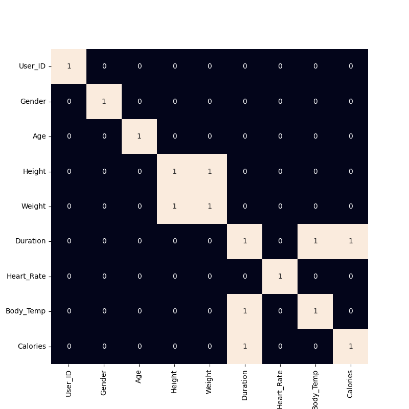
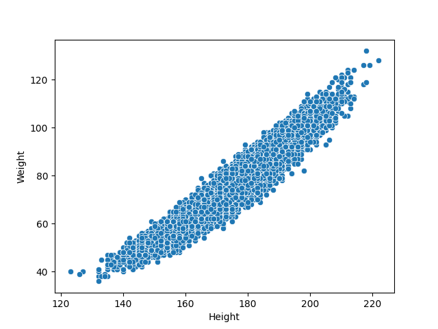
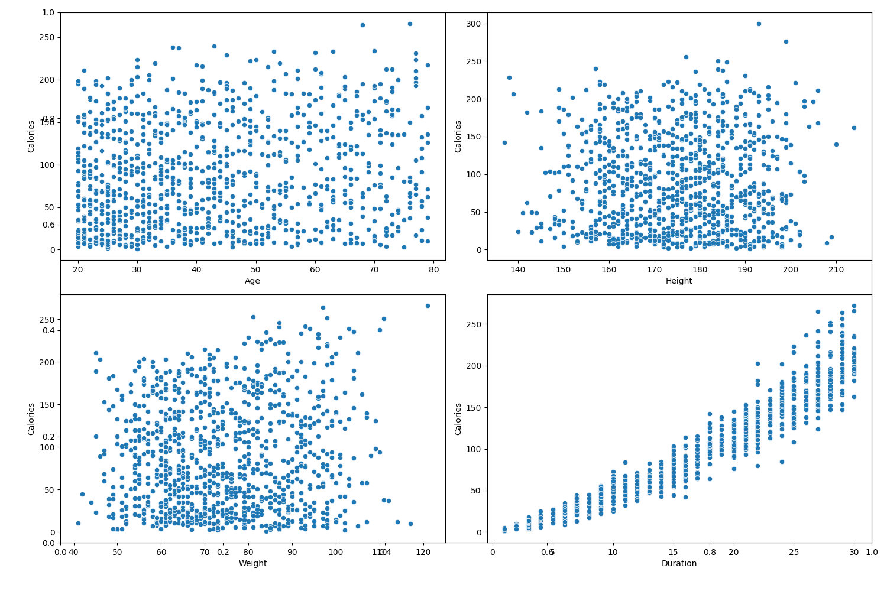
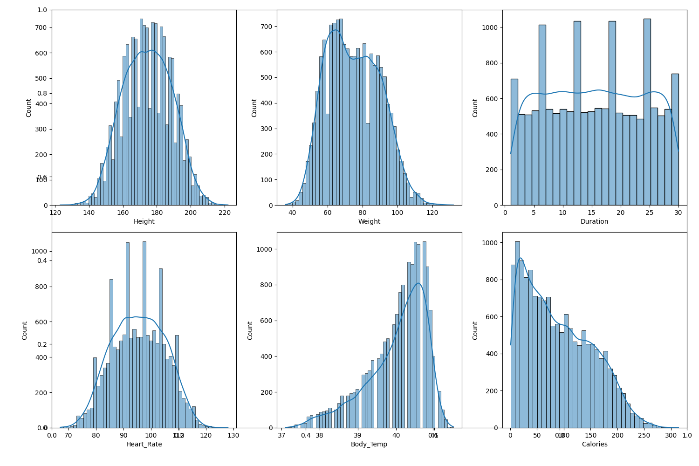

# 🔥 Calories Burnt Prediction using Machine Learning

## 📌 Project Overview
This project focuses on analyzing exercise and body-related parameters to predict the number of **calories burnt** using Machine Learning techniques.  
It includes data visualization, feature engineering, and multiple regression models to evaluate prediction accuracy. :contentReference[oaicite:0]{index=0}

The project is built using Python with libraries such as **Pandas, Matplotlib, Seaborn, Scikit-learn, and XGBoost**.

---

## ⚙️ Machine Learning Models Used
The following regression models are trained, validated, and compared:

- **Linear Regression**
- **Lasso Regression**
- **Ridge Regression**
- **Random Forest Regressor**
- **XGBoost Regressor**

Performance is evaluated using **Mean Absolute Error (MAE)** on training and validation datasets.

---

## 🔄 Project Workflow
1. Load and explore the datasets  
2. Perform **Exploratory Data Analysis (EDA)**  
3. Visualize relationships between features  
4. Encode categorical variables  
5. Remove highly correlated features  
6. Scale features using StandardScaler  
7. Train and evaluate different regression models  
8. Compare model performance and select the best model  

---

## 🎯 Key Findings
- Identified key features that contribute to calorie burn
- Compared performance among multiple regression models
- Built an end-to-end pipeline for calorie prediction

---
## 📊 Data Visualizations

### 1️⃣ Correlation Heatmap
Shows the correlation between different features in the dataset to help identify strong relationships.

---

### 2️⃣ Scatter Plot (Height vs Weight)
Illustrates the relationship between **height** and **weight** of users.

---

### 3️⃣ Features vs Calories Scatter Plot
Shows how features like age, height, weight, and duration relate to **calories burnt**.

---

### 4️⃣ Histogram
Displays the distribution of key numerical features to understand data spread and skewness.

## 🛠️ Technologies Used
- Python  
- Pandas & NumPy  
- Matplotlib & Seaborn  
- Scikit-learn  
- XGBoost  

---

## 📌 Conclusion
This project demonstrates a complete machine learning workflow — from data preprocessing and visualization to modeling and evaluation — and is a strong foundation for understanding regression analysis and real-world prediction problems.

---

### 📁 Repository Link
Explore the full project on GitHub:  
https://github.com/Krish-Bavariya/Calories_Burnt_Predication

---

Let me know if you want this **enhanced with badges**, **installation instructions**, or **demo screenshots**! 🚀
::contentReference[oaicite:1]{index=1}
